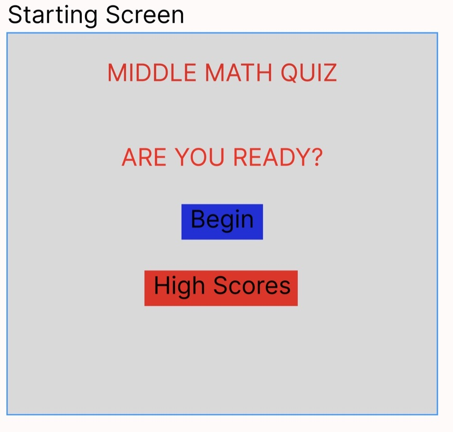
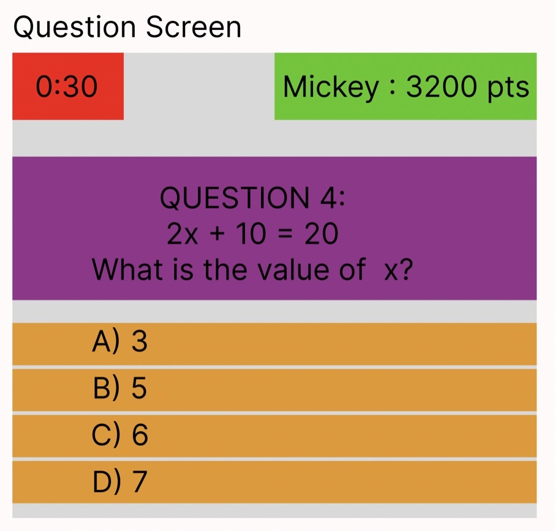
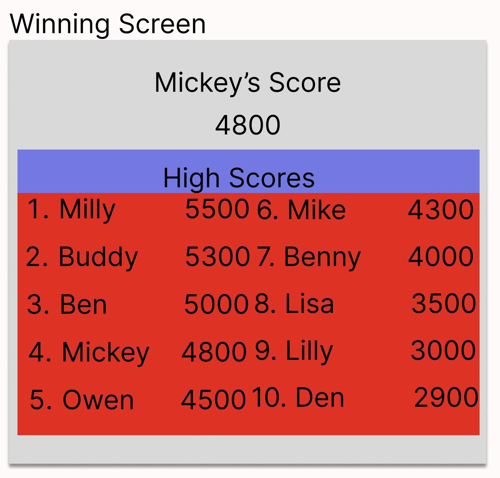

# middlemathquiz.github.io

Project Description
My app is called Middle Math Trivia Game. It is an app for players who want to challenge their middle school math skills. It can be played solo and is a challenge to get the highest score. The score will be taken automatically and the longer the player takes to answer the lower the score will be. The solo player will answer 10 questions, display the current score while playing the game, and when the game ends show where the player places within the top 10.

Wire Frames
Copy and paste or drag and drop your images here.

MVP Goals
As a player, I want my game to let me enter my name so that it is displayed while playing.
As a player, I want to see the timer and the score go down as time goes on.
As a player, I want my game to recognize a correct answer to a question so the score will go up.
As a player, I want my game to show the time left when answering a question.
As a player, I would like to be able to restart the game after the game ends.
As a player, I want the UI to be engaging and out of the way so that I enjoy the experience of playing the game.**

Stretch Goals
As a player, I would like a victory animation when I am in the top 10.
As a player, I would like to pick a difficulty level.
As a player, I would like to hear an audible sound while I am playing the game.
As a player, I would like to play this game online vs another player.
As a player, I would like to be informed of the score when the game is over and see if I am in the top 10.

GitHub Repository Link: https://github.com/mickey-40/middlemathquiz.github.io

GitHub Pages Link: https://mickey-40.github.io/middlemathquiz.github.io/